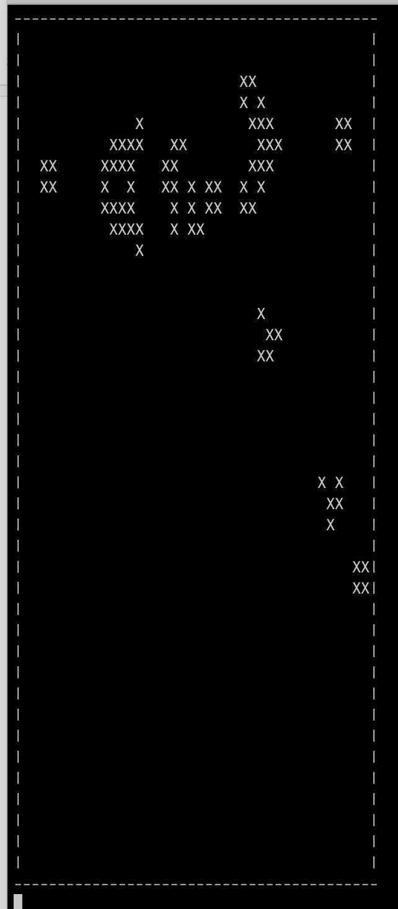

# Conway-s-Game-of-Life
Conway's Game of Life programmed in C++.

Makefile provided for easy compilation.

After running the program two options are available.

Interactive mode options: 
   a : ask for coordinates where to add a new live cell (no action needed if cell is already alive). 
   r : ask for coordinates where a cell should be removed (no action needed if cell is already dead). 
   n : advance the simulation to the next iteration by applying the rules of the game. 
   q : quit the program. 
   p : play the game continuously (forever, without asking for more input; you can press control-C to stop the program).
 
Batch mode (ex: ./playfile scene1.txt)

  If a file is passed as an argument its information its loaded in and the simulation then runs.  
  I have provided 5 examples of .txt files that can be passed with proper formating.
  
  
 
